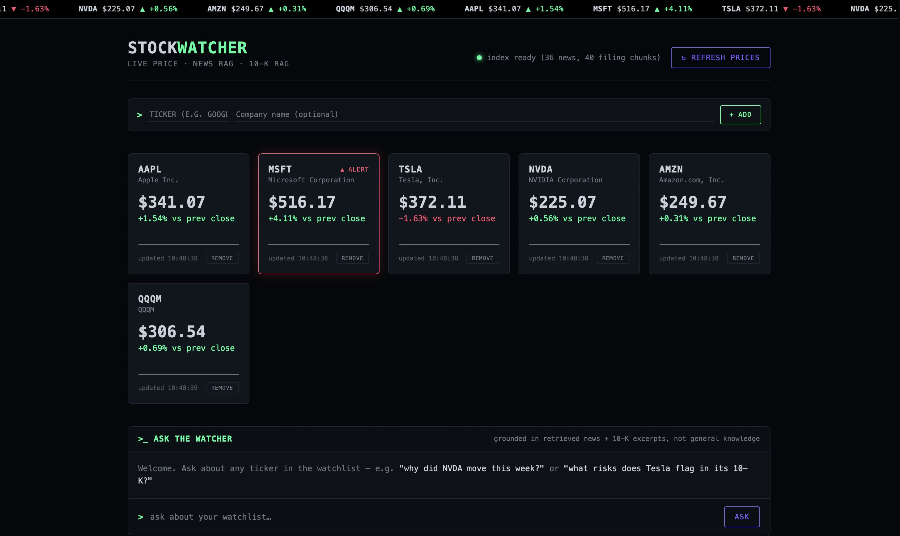
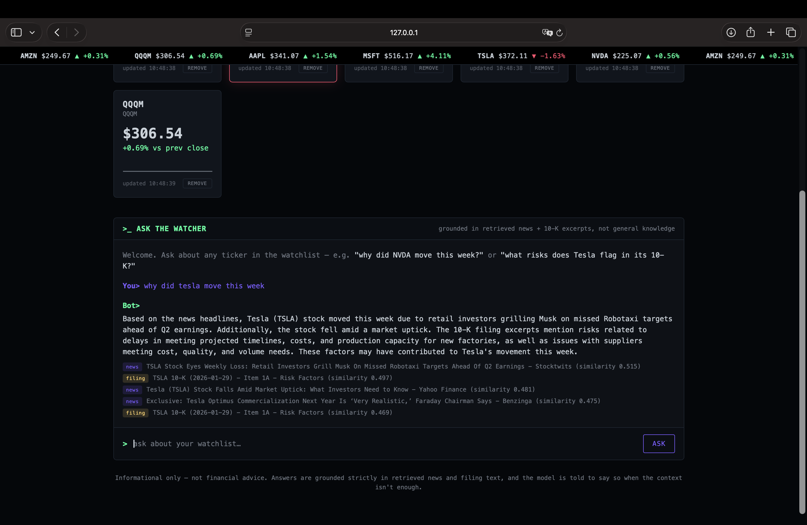

# Stock Watcher — price tracking + RAG over news AND 10-K filings

A small, self-contained project that combines three things into one bot:

1. **Live price tracking** for a watchlist of 5 well-known stocks, with
   simple threshold alerts.
2. **RAG over recent news** — good for "what's happening right now"
   questions.
3. **RAG over 10-K filing excerpts** (Risk Factors + Management's
   Discussion and Analysis sections) — good for deeper "what does the
   company itself say about its risks/strategy" questions.

Both source types are embedded into the same index, so one chat loop can
answer short-term questions from news and fundamentals questions from
filings — and it tells you which kind of source it used.

Watchlist: **AAPL** (Apple), **MSFT** (Microsoft), **TSLA** (Tesla),
**NVDA** (NVIDIA), **AMZN** (Amazon) — edit `watchlist.json` to change it.

## Screenshots

| Dashboard | Ask the Watcher |
|---|---|
|  |  |

## How it works

| File | What it does |
|---|---|
| `watchlist.json` | The 5 tickers being tracked, with tickers, full names, and colloquial aliases used for question matching. |
| `price_watcher.py` | Pulls the latest price for each ticker via [yfinance](https://github.com/ranaroussi/yfinance) (free, no API key), logs it to `price_log.json`, and prints an alert if any stock moved more than 3% since the previous close. |
| `news_fetch.py` | Pulls recent headlines for each ticker from Google News' public RSS search (free, no API key) and saves them to `news_cache.json`. |
| `filings_fetch.py` | Pulls each ticker's most recent 10-K from SEC EDGAR (free, but requires a descriptive `EDGAR_USER_AGENT` — see Setup), extracts the Risk Factors and MD&A sections, splits them into overlapping chunks, and saves them to `filings_cache.json`. |
| `build_index.py` | Combines `news_cache.json` and `filings_cache.json`, embeds everything with OpenAI's `text-embedding-3-small`, and caches the vectors to `embeddings_cache.json` — so you only pay for embeddings once per refresh. |
| `rag_chat.py` | The combined RAG loop (used by both the CLI and the web UI): embeds your question, retrieves the most relevant chunks across *both* news and filings via cosine similarity, pulls in the latest logged price for any mentioned ticker, and asks GPT to answer *only* from that context — labeling each source as news or filing, and saying which it relied on. |
| `app.py` + `templates/` + `static/` | A small Flask web front end — a dashboard of the 5 tickers with live prices, alert flags, and price-history sparklines, plus a chat panel for the same Q&A `rag_chat.py` does on the command line, and an add/remove UI for the watchlist. It's a thin layer: no logic is duplicated, `app.py` just calls the functions above and renders the result as HTML/JSON. It also wraps every write to the shared JSON files in a file lock and rate-limits the two API-calling routes — see Concurrency & cost safety below. |
| `tests/` | A `pytest` suite covering the pure logic in every file above (percent-change math, RSS/HTML parsing, the 10-K table-of-contents-vs-real-section heuristic, ticker detection and retrieval, the watchlist add/remove flow, rate limiting, file locking) — see Running the tests below. |

## Setup

```bash
pip install -r requirements.txt
export OPENAI_API_KEY="your-key-here"           # use a fresh key — see note below
export EDGAR_USER_AGENT="Your Name your.email@example.com"   # SEC requires this, see below
```

SEC EDGAR requires every automated request to identify who's making it —
see [their developer FAQ](https://www.sec.gov/os/webmaster-faq#developers).
`filings_fetch.py` will refuse to run without `EDGAR_USER_AGENT` set,
rather than sending requests SEC's servers might block.

Then, in order:

```bash
python3 price_watcher.py    # logs current prices, prints any big moves
python3 news_fetch.py       # pulls recent news for the watchlist
python3 filings_fetch.py    # pulls the latest 10-K excerpts for the watchlist
python3 build_index.py      # embeds news + filings together
python3 rag_chat.py         # ask questions
```

`filings_fetch.py` only needs to be re-run occasionally (10-Ks are filed
annually); `price_watcher.py` and `news_fetch.py` are worth re-running
daily. Re-run `build_index.py` after refreshing either cache so the
embeddings stay in sync.

### Verifying the 10-K extraction

10-K formatting varies enough between companies that the section-finding
heuristic in `filings_fetch.py` (it tells the real "Item 1A" apart from
its mention in the table of contents by picking whichever match spans
the most text) is worth actually checking the first time you run it for
real — this was built and tested against a synthetic filing I wrote
myself, never against a real one. When you run `python3 filings_fetch.py`,
it now prints, per ticker: which section it found (or a `[!]` warning if
it had to fall back to just grabbing the filing's opening text instead),
a length, and a short text preview — so you can eyeball whether each one
actually grabbed the real Risk Factors / MD&A text before trusting it.
If a ticker's extraction looks wrong, its 10-K likely uses a formatting
structure `SECTION_PATTERNS` in `filings_fetch.py` doesn't anticipate,
and the regex there is the place to adjust.

## Web UI

Once you've run the fetch/index steps above at least once, you can use
the dashboard instead of the terminal:

```bash
python3 app.py
```

Then open `http://127.0.0.1:5000`. It's a dark, monospace "trading
terminal" style dashboard — a scrolling ticker tape, one card per stock
with the live price, a small sparkline of its recent price history, and
a red alert flag on any move past the 3% threshold, and a terminal-style
chat panel below it for the same questions `rag_chat.py` answers on the
command line (with the same retrieved-sources breakdown, tagged news vs.
filing). The sparkline only appears once a ticker has at least two
logged price points — run `price_watcher.py` (or click Refresh) a few
times over a few days to see it fill in.

The Refresh Prices button hits yfinance live, the same as running
`price_watcher.py`. Building or refreshing the news/filing index is
still a deliberate command-line step (`news_fetch.py` /
`filings_fetch.py` / `build_index.py`) rather than something the page
triggers automatically — those calls cost real API requests and take a
few seconds each, so they shouldn't silently fire on every page load. If
you open the dashboard before running them, it'll tell you so in the
status line and the chat panel.

### Adding / removing tickers from the dashboard

The "+ ADD" row above the cards lets you add a stock without touching
`watchlist.json` by hand: type a ticker (and optionally a company name),
hit Add, and it will — for that one ticker — fetch a live price, pull
recent news, pull its latest 10-K excerpts, and embed all of it into the
index, then reload the page. This does make real API calls (SEC + OpenAI)
and can take up to ~20 seconds, which is why it's a deliberate button
click rather than something that happens automatically. If the ticker
symbol isn't valid, nothing is added — it's checked against yfinance
first before anything is written.

Each card has a REMOVE button — click once to arm it (it'll show
"CONFIRM?"), click again within a few seconds to actually remove it, or
just wait and it resets. Removing a ticker deletes it from the watchlist
*and* purges it from the price log, news cache, filings cache, and the
embeddings index — not just hidden from the dashboard.

Editing `watchlist.json` directly and re-running the CLI scripts (as
described in Setup above) still works exactly the same way if you prefer
that — the UI buttons are just a faster path for one ticker at a time.

## Concurrency & cost safety

Two things `app.py` does that are easy to miss but worth knowing about:

- **File locking.** `watchlist.json`, `price_log.json`, `news_cache.json`,
  `filings_cache.json`, and `embeddings_cache.json` are all shared state
  read and rewritten by multiple routes. Every route that modifies them
  (`/api/refresh_prices`, `/api/watchlist/add`, `/api/watchlist/remove`)
  wraps its whole read-modify-write in a file lock (`data_lock()`, via
  the `filelock` package), so two requests landing at nearly the same
  moment can't silently overwrite each other's changes — one waits its
  turn. If the lock can't be acquired within 20 seconds, the route
  returns a 503 rather than hanging forever.
- **Rate limiting.** `/api/ask` and `/api/watchlist/add` both cost real
  API calls (OpenAI, and for add, SEC too), so both are capped
  in-memory — 20 questions/minute, 10 adds/minute — mostly as a guard
  against a stuck tab or an accidental double-click running up a bill,
  not as a defense against a determined attacker. Hitting the limit
  returns a 429 with a plain-English message.

Neither of these needs any setup — they're on by default.

## Running the tests

```bash
pip install -r requirements-dev.txt
pytest
```

The suite (in `tests/`) covers the pure logic across every module —
percent-change math, RSS/HTML parsing, the 10-K table-of-contents-vs-
real-section heuristic, ticker/alias detection, retrieval ranking, the
watchlist add/remove flow (with SEC/OpenAI/yfinance all mocked, so
running the tests costs nothing and needs no API keys), the rate
limiter, and the file-locking behavior under a simulated concurrent
write. It does not, and can't, test the live network calls themselves —
that's what the checklist under Verifying the 10-K extraction above is
for.

## Deploying beyond your own machine

Everything above assumes you're running this on your own computer and
you're the only one using it — that's what it's built and tested for.
If you ever want to put it somewhere reachable by other people, a few
things in `app.py` that are deliberately *off* by default need turning
on first:

- Set `FLASK_DEBUG=0` (or just leave it unset — that's already the
  default) so Werkzeug's interactive debugger is never exposed; it lets
  anyone who can reach it execute arbitrary code.
- Run it behind a real WSGI server instead of Flask's built-in one, e.g.
  `pip install gunicorn` then `gunicorn app:app`.
- Set `APP_PASSWORD` to something private — every request will then
  require HTTP Basic Auth with that password. It's a single shared
  password, not real per-user auth, but it's enough to stop a random
  visitor from running up your OpenAI bill.
- Consider whether the rate limits above (tuned for one person clicking
  around) are still appropriate for however many people might use it.

None of this is needed for running it locally, which is the intended
use here.

### Serverless deploy (AWS Lambda, container image)

This repo includes a ready-to-use serverless deployment: Docker +
Terraform + a GitHub Actions pipeline, targeting AWS Lambda behind a
public Function URL — no servers to patch or pay for while idle.

**Architecture**

- The exact same Flask app, run by gunicorn inside a container, fronted
  by the [AWS Lambda Web Adapter](https://github.com/awslabs/aws-lambda-web-adapter)
  (a Lambda extension that translates Function URL requests into normal
  HTTP calls) — so nothing in `app.py` had to change for Lambda.
- `watchlist.json`, `price_log.json`, `news_cache.json`, and
  `filings_cache.json` move to DynamoDB (one item each); `embeddings_cache.json`
  moves to S3 (a few MB — over DynamoDB's 400KB item limit). See
  `storage.py` — it's a drop-in swap: local files when run normally,
  DynamoDB/S3 when `AWS_LAMBDA_FUNCTION_NAME` is set. Local development
  is completely unaffected.
- Terraform (`terraform/`) owns the infrastructure: ECR repo, Lambda
  function + Function URL, DynamoDB table, S3 bucket, IAM roles,
  CloudWatch log group, and a GitHub OIDC role so CI can deploy without
  a stored AWS access key.
- `.github/workflows/deploy.yml` owns the app: on every push to `main`
  it runs the test suite, then (if tests pass) builds the image, pushes
  it to ECR, and points the Lambda function at the new image.

**Staying free.** Lambda's always-free tier (1M requests + 400,000
GB-seconds/month, no expiration) comfortably covers personal-project
traffic. The Function URL has no separate charge (unlike putting API
Gateway or a load balancer in front). DynamoDB is provisioned at 5
read/write capacity units, inside its always-free 25/25 allowance. The
only non-$0 pieces are ECR image storage and the S3 objects — a few
cents a month at most for this project's size — plus your own OpenAI
usage, same as running it locally.

**One-time setup, in order:**

```bash
# 1. AWS account + CLI, if you don't have them already
aws configure
# set a billing alarm now — https://console.aws.amazon.com/billing/home#/budgets

# 2. Terraform: create everything except the Lambda function's real code
cd terraform
cp terraform.tfvars.example terraform.tfvars   # fill in edgar_user_agent, aws_region, github_repo
export TF_VAR_openai_api_key="sk-..."          # never put this in a file
export TF_VAR_app_password="something-private" # optional — leave unset for a fully public demo
terraform init
terraform apply

# 3. GitHub: add these repo secrets (Settings -> Secrets and variables -> Actions)
#      AWS_ROLE_ARN         <- terraform output github_actions_role_arn
#      AWS_REGION           <- same region you used above
#      ECR_REPOSITORY_NAME  <- terraform output ecr_repository_url (just the repo name part)
#      LAMBDA_FUNCTION_NAME <- terraform output lambda_function_name

# 4. Push to main — GitHub Actions builds the image, pushes it, and
#    updates the Lambda function. First run takes a few minutes.
git push

# 5. Seed real data into DynamoDB/S3 (otherwise the live app starts empty)
export DYNAMODB_TABLE=$(terraform output -raw dynamodb_table_name)
export S3_BUCKET=$(terraform output -raw s3_bucket_name)
cd ..
python3 seed_cloud_storage.py

# 6. Open it
terraform -chdir=terraform output function_url
```

Before any of this, build and run the container locally at least once —
this sandbox this project was developed in has no Docker daemon, so the
image itself has only been reviewed, not build-tested:

```bash
docker build -t stock-watcher .
docker run -p 8000:8000   -e OPENAI_API_KEY="sk-..."   -e EDGAR_USER_AGENT="Your Name your.email@example.com"   stock-watcher
curl http://localhost:8000/api/status
```

That runs it in local-file mode (no `AWS_LAMBDA_FUNCTION_NAME` set), so
it's a check that the image itself is sound before layering Lambda on
top.

**Known limitation:** the file-lock concurrency guard (see *Concurrency
& cost safety* above) only protects requests landing in the same warm
Lambda execution environment, not across Lambda's separate concurrent
instances — a DynamoDB-backed distributed lock would close that gap, but
wasn't worth the extra complexity for a low-traffic personal demo. Worth
knowing about, not worth losing sleep over at this scale.

## Example

```
You: what risks does Tesla flag in its 10-K, and how's the stock doing lately?

  [retrieved sources]
   - [filing] TSLA-10K-1 (similarity: 0.61): TSLA 10-K (2026-01-29) - Item 1A - Risk Factors
   - [news ] TSLA-news-0 (similarity: 0.47): Tesla shares climb after delivery numbers beat estimates
   - [filing] TSLA-10K-2 (similarity: 0.44): TSLA 10-K (2026-01-29) - Item 1A - Risk Factors

Bot: According to Tesla's 10-K (filing source), the company flags risks
including competitive pressure in the EV market, regulatory changes, and
supply chain dependencies. Separately, recent news shows the stock has
been climbing after delivery numbers beat estimates. (Not financial advice.)
```

## Important notes

- **This is informational, not financial advice** — the prompt explicitly
  tells the model not to recommend buying or selling, and to say so if the
  context isn't enough to answer confidently.
- **Use a fresh OpenAI API key**, not the one that leaked in your NutriBot
  hackathon project's server logs earlier — rotate that old key if you
  haven't already.
- Google News RSS and Yahoo Finance occasionally rate-limit or change
  their response format without warning, since neither is an official,
  stable API. SEC EDGAR is an official API but is strict about the
  User-Agent requirement and about request rate (the script already adds
  small delays between requests to stay well under SEC's limits).
- 10-K documents vary in structure company to company, so
  `filings_fetch.py`'s section extraction is heuristic (it picks the
  longest plausible match for "Item 1A" / "Item 7" to avoid grabbing the
  table of contents instead of the real section — see the tests in the
  code's logic). It falls back to just taking the filing's opening text
  if it can't confidently find either section, so it degrades gracefully
  rather than failing outright.
- This was built and tested (see `tests/`) with fixture data — fake RSS
  feeds, a synthetic 10-K-shaped document, fake price snapshots, fake
  embeddings — in a sandboxed environment that couldn't reach Yahoo
  Finance, Google News, SEC EDGAR, or the OpenAI API directly. The logic
  is genuinely tested; the live network behavior isn't, so do a first
  live run yourself before relying on it for a demo (see Verifying the
  10-K extraction above).
- `price_log.json` won't grow forever — `price_watcher.py` automatically
  keeps only the most recent 500 snapshots per ticker (`MAX_HISTORY_PER_TICKER`
  in `price_watcher.py`) each time it saves.

## Cost

Embedding ~30 news articles + ~40 filing chunks (5 tickers × 2 sections ×
up to 8 chunks) is still well under a cent with `text-embedding-3-small`.
Each question costs one small embedding call plus one short GPT-3.5
completion. Expect well under $1 for a full day of building and testing.

## Extending this

- Swap Google News RSS for a real news API (e.g. NewsAPI, Finnhub) for
  more reliable, richer article text instead of just headlines/summaries.
- Persist price history properly (SQLite instead of a flat JSON file) so
  the sparklines can show trends over months without relying on how
  often you happen to have run `price_watcher.py`.
- Auto-refresh the dashboard on an interval instead of a manual button,
  or deploy it (see Deploying beyond your own machine above) so it's
  reachable without your own machine running.
- Pull in earlier 10-Ks (not just the latest) to answer "how has this risk
  language changed year over year" — a genuinely hard, interesting RAG
  problem if you want to go further.
- Add sentiment scoring on the news articles and surface it alongside the
  price data.
- Swap the in-memory rate limiter for something that survives a restart
  (e.g. a small SQLite table) if you ever run this somewhere long-lived.
